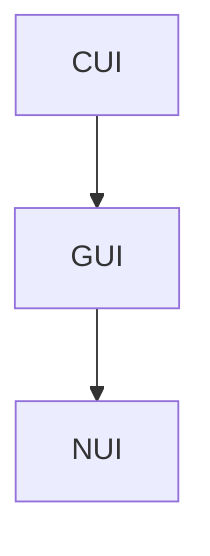

# ユーザー・インターフェース

　ユーザー・インターフェース、略してUIは、利用者がマシンと伝達する部分のことをいう。UNIX系OSではターミナル(または端末)、Windowsではコマンドプロンプトがベースとなる。  
　またUIにはカテゴリがある。ターミナル自体はキャラクター・ユーザー・インターフェースに当てはまる。略してCUI(シー・ユー・アイ)という。  
　マシンでUIをいうと、そのアプリケーションは、ほとんどがCUIベースだろう。これは90年代にWindowsが業界を席巻したにより、グラフィカルになったアプリのほうが主流と化してきた。こちらはグラフィカル・ユーザー・インターフェースと呼ばれ、略称はGUI(グーイ、グイ、ジー・ユー・アイ)と呼ばれる。  
　今ではNUI(エヌ・ユー・アイ、ニューイ、ヌイ)のほうが人々が触れることが多い。こちらはスマホやタブレット端末が実装するUIで、ナチュラル・ユーザー・インターフェースの略語となっている。  

　実装のレベルでは、GUI型アプリケーションはCUI型アプリケーションを踏襲したものとなっている。NUI型アプリケーションもそうで、GUI型アプリケーションがベースとなっている。  



　UNIX系OSではアプリケーションのインストールなどは端末からアクセスする。逆の操作である(Windowsでいう)アンインストールは、こちらでは`purge`とか`remove`などのサブコマンドで行う。  
　CUI型アプリケーションもGUI型アプリケーションも、端末から操作する。

　おそらくUbuntuの全てのオーナーが初めて操作するコマンドは以下だろう。

```
$ sudo apt update
```

　スードー・エー・ピー・ティー・アップデートとタイプしてエンターキーを押す。APT{エー・ピー・ティー}は、ソフトウェアおよびパッケージを管理するDebian系列OSに含まれるソフトウェアであり、UbuntuはDebian系列である。このコマンドは、現時点で流通するパッケージ/ソフトウェアのリポジトリ情報を最新にするものである。  
　`sudo`は**s**uper-**u**ser **do**のアクロニムで、「管理者として実行」という意味になる。具体的には**root権限**と呼ばれ、多くの重大な操作はオーナーがこれで実行しなければならないことが多く、このコマンドもその一つである。  
　また管理者として実行する場合、まずはじめに設定したパスワードの入力を求められる。  

```
[sudo] ***のパスワード: 
```

　**なお、この状態でタイプしてもエンターキーを押さない限り文字列は表示されない。**  

　現時点でインストールされているソフトウェアは、以下のコマンドでアップグレードできる。  

```
$ sudo apt upgrade
```

　途中で“続行しますか？[Y/n]”と尋ねられるので、適当に`Y`をタイプする。  

　GUI型アプリケーションはリポジトリが異なっていて、大概はSNAP{スナップ}が管理している(ようである)。これはオーナーが別途インストールしなくてはいけない。以下のようにタイプする:  

```
$ sudo apt install snapd
```

　アプリケーション名は`snap`だが、インストールするときにAPTのリポジトリ名では`snapd`のようである。  
　このコマンドでインストールしたら、以下のようにしてアプリケーションをインストールできるようになる:  

```
$ sudo snap install ***
```

　おおまかにCUI型アプリケーションはAPT、GUI型アプリケーションはsnapで管理すると覚えてよいだろう。  
　アンインストールでは各々以下のコマンドを使用する:  

```
$ sudo apt purge ***
$ sudo snap remove ***
```

　ところで、APTコマンドには、他に`apt-get`や`aptitude`がある。これはCLI(コマンドライン・インターフェース)で使うコマンドで、aptitudeはターミナルとCLIのいずれにも対応する。  

　`apt-get`はトラブルシューティングでごくごく使うことがあり、覚えておくべきだろう。  
　例えばディスプレイ・マネージャーである`gdm3`である。NVIDIA GeForceのドライバはUbuntuではサードパーティ製として扱われており、カーネルにありながらカーネルの一部ではない。そのため、ディスプレイ・マネジメントで問題が発生した場合、`gdm3`が起動せず起動できないトラブルが発生することがごくごくある。  
　そのときにはレスキュー・モードで起動して、`gdm3`をアンインストールして再インストールする。コマンドは以下:

```
$ sudo apt-get purge gdm3
$ sudo apt-get install gdm3
$ sudo systemctl reboot
```
